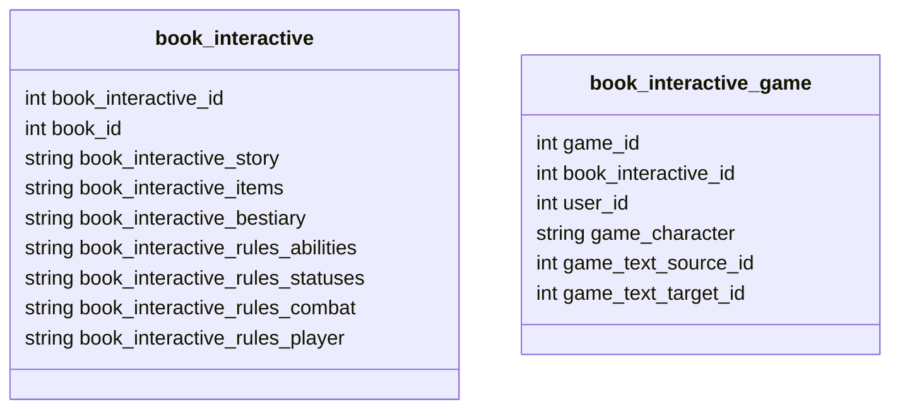

# Game Text Engine
[](https://packagist.org/packages/velkuns/game-text-engine)
[](https://packagist.org/packages/velkuns/game-text-engine)

[](https://sonarcloud.io/dashboard?id=velkuns_game-text-engine)
[](https://sonarcloud.io/dashboard?id=velkuns_game-text-engine)

## Why?

This is a PHP Game Text Engine to create games based on texts, with choices, items, and more.


## Installation

If you wish to install it in your project, require it via composer:

```bash
composer require velkuns/game-text-engine
```


## API Documentation

### Game Object

```php

declare(strict_types=1);

namespace Application;

use Velkuns\GameTextEngine\Api\ItemsApi;
use Velkuns\GameTextEngine\Api\PlayerApi;
use Velunns\GameTextEngine\Api\GameApi;
use Velkuns\GameTextEngine\Core\Factory\AbilityFactory;
use Velkuns\GameTextEngine\Core\Loader\JsonLoader;

//~ Factories
$modifierFactory  = new ModifierFactory();
$itemFactory      = new ItemFactory($modifierFactory);
$conditionFactory = new ConditionsFactory(new ConditionParser(), new ConditionElementResolver(), new ConditionValidator());
$graphFactory     = new GraphFactory($conditionFactory);
$abilityFactory   = new AbilityFactory();
$entityFactory    = new EntityFactory(
    $abilityFactory, 
    new StatusFactory($modifierFactory, $conditionFactory), 
    $itemFactory
);

$items   = new ItemsApi($itemFactory);
$gameApi = new GameApi(
    new JsonLoader(),
    new StoryApi($graphFactory),
    $items,
    new BestiaryApi($entityFactory, $items),
    new AbilitiesApi($abilityFactory),
    new PlayerApi($entityFactory, $items),
    new CombatApi(new Randomizer(new Mt19937())),
);

//~ Load json data (can be from files or strings if came from database)
$storyData          = $game->loader->fromFile($dataDir . '/stories/test.json');
$itemsData          = $game->loader->fromFile($dataDir . '/items.json');
$bestiaryData       = $game->loader->fromFile($dataDir . '/bestiary.json');
$abilitiesRulesData = $game->loader->fromFile($dataDir . '/rules/rules_abilities.json');
$statusesRulesData  = $game->loader->fromFile($dataDir . '/rules/rules_statuses.json');
$combatsRulesData   = $game->loader->fromFile($dataDir . '/rules/rules_combat.json');
$playerRulesData    = $game->loader->fromFile($dataDir . '/rules/rules_player.json');
$playerData         = $game->loader->fromFile($dataDir . '/templates/player.json');

//~ Load data into the game api
$gameApi->load(
    $storyData, 
    $itemsData, 
    $bestiaryData, 
    $statusesRulesData, 
    $combatsRulesData, 
    $playerRulesData, 
    $playerData
);

//~ Access to the other apis
$gameApi->storyApi->[...];
$gameApi->bestiaryApi->[...];
$gameApi->itemsApi->[...];
$gameApi->abilitiesApi->[...];
$gameApi->statusesApi->[...];
$gameApi->playerApi->[...];

//~ Dumping apis into json data

/**
 * @phpstan-return array{
 *     story: string,
 *     items: string,
 *     bestiary: string,
 *     abilitiesRules: string,
 *     statusesRules: string,
 *     combatRules: string,
 *     playerRules: string,
 *     playerData: string,
 * } $data Array of json data, to save in files or database
 */
$data = $gameApi->dump(/* true */); // true to pretty json output

//~ Exporting story graph into DOT data
$gameApi->exporter->toFile($gameApi->storyApi->graph, [...]);      // export story graph to file
$string = $gameApi->exporter->toString($gameApi->storyApi->graph); // export story graph to string

//~ Game API read
$source = '1';
$target = '2';
$gameApi->read($source, $target);

```

### Loader (to load data from files / strings):

```php
<?php

declare(strict_types=1);

namespace Application;

use Velkuns\GameTextEngine\Util\Loader\JsonLoader;

$loader  = new JsonLoader();

//~ To load data from a file
$data = $loader->fromFile('/path/to/data.json');

//~ To load data from a string (JSON format, can be stored in database)
$data = $loader->fromString('{"key": "value"}');

```

### Items API

```php
<?php

declare(strict_types=1);

namespace Application;

// [... game api init code here ... ]

//~ Get an item by its name
$item = $game->items->get('Rusty Sword');

$staff = $itemFactory->from(['name' => 'Staff', ...]);
$gameApi->items->set($staff); // Adds or replaces the item in the items dictionary
$gameApi->items->remove($staff->getName()); // Removes the item from the items dictionary
```

### Bestiary API

```php
<?php

declare(strict_types=1);

namespace Application;

// [... game api init code here ... ]

//~ Get a creature by its name
$entity = $gameApi->bestiary->get('Goblin');

$goblinWarrior = $entityFactory->from(['name' => 'Goblin Warrior', ...]);
$gameApi->bestiary->set($goblinWarrior); // Adds or replaces the creature in the bestiary
$gameApi->bestiary->remove('Goblin'); // Removes the creature from the bestiary
```

### Abilities API

```php
<?php

declare(strict_types=1);

namespace Application;

// [... game api init code here ... ]

//~ Return all abilities: array{bases: array<string, AbilityInterface>, compounds: array<string, AbilityInterface>}
$abilities = $gameApi->abilities->getAll();

$ability = $gameApi->abilities->get('strength'); // Get one ability (cloned)
$gameApi->abilities->set($ability); // Set an ability
$gameApi->abilities->remove('strength');
```

### Statuses API

```php
<?php

declare(strict_types=1);

namespace Application;

// [... game api init code here ... ]

//~ Return all statuses: array<string, array<string, StatusInterface>>
$statuses = $gameApi->statuses->getAll();

$status = $gameApi->statuses->get('skill', 'Goblin Hunter'); // Get one status (cloned)
$gameApi->statuses->set($status); // Set an ability
$gameApi->statuses->remove('skill', 'Goblin Hunter');
```

### Story API

```php
<?php

declare(strict_types=1);

namespace Application;

// [... game api init code here ... ]

//~ Start the story - retrieve the first node of the story
$text = $gameApi->story->start();

// define $player before
  
//~ Get possible choices
$choices = $gameApi->story->getPossibleChoices($node->id, $player);

//~ Then display choices to the player, get his choice and advance the story
$playerChoice = $choices[0];
$nextText = $gameApi->story->goto($playerChoice->source, $playerChoice->target, $player/*[, $enemy]*/); // A validation is made to be sure the choice is valid
```

### Player API

```php
<?php

declare(strict_types=1);

namespace Application;

// [... game api init code here ... ]

//~ Create a new player based on the given data
$data = [
    'name'        => 'New Hero',
    'age'         => 25, // optional, default 20
    'race'        => 'elf', // optional, default 'human'
    'description' => 'A brave adventurer.', // optional, default ''
    'background'  => 'Born in a small village.', // optional, default ''
    'abilities'   => [,
        'strength'  => 10,
        'endurance' => 12,
        'agility'   => 14,
        'intuition' => 13,
    ], 
    'inventory' => ['Rusty Sword'], // optional, default []
];

$gameApi->player->new($data);

//~ Get player object
$player = $gameApi->player->player;


```

### Combat API

```php
<?php

declare(strict_types=1);

namespace Application;

// [... game api init code here ... ]

$enemies = [
    $gameApi->bestiary->get('Rat'), // get clone
    $gameApi->bestiary->get('Rat'), // get clone
];

$logs = $gameApi->combat->auto($gameApi->player->player, $enemies);

//~ Display combat results
// ... your code to display combat turns ...

```

### Access to the Story's graph

```php
<?php

declare(strict_types=1);

namespace Application;

// [... game api init code here ... ]

$graph = $gameApi->story->graph;

//~ Manipulate graph nodes
$graph->addNode(new Node(...));
$graph->removeNode('node_id');

//~ Manipulate graph edges (between nodes).
$graph->addEdge(new Edge(...));
$graph->removeEdgeBetweenNodes('node_id_source', 'node_id_target');
```

> [!IMPORTANT]
> When add edges, source node and target node must have already been added to the graph.

## Symfony Integration
### Yaml config
```yaml
parameters:
  # Path to initial game data
  game.data.dir:      '../../vendor/velkuns/game-text-engine/data'

  # Files to load when create new story. Should be stored in database after.
  game.data.story:    '%game.data.dir%/stories/test.json'
  game.data.bestiary: '%game.data.dir%/bestiary.json'
  game.data.items:    '%game.data.dir%/items.json'
  game.data.player:   '%game.data.dir%/templates/player.json'

  # Rules files to load when create new story. Should be stored in database after.
  game.data.rules.abilities: '%game.data.dir%/rules/rules_abilities.json'
  game.data.rules.statuses:  '%game.data.dir%/rules/rules_statuses.json'
  game.data.rules.combat:    '%game.data.dir%/rules/rules_combat.json'
  game.data.rules.player:    '%game.data.dir%/rules/rules_player.json'

services:
  _defaults:
    autowire: true
    bind:
      $typeResolvers:
        - '@Velkuns\GameTextEngine\Core\Resolver\AbilityResolver'
        - '@Velkuns\GameTextEngine\Core\Resolver\EntityDamagesResolver'
        - '@Velkuns\GameTextEngine\Core\Resolver\EntityInfoResolver'
        - '@Velkuns\GameTextEngine\Core\Resolver\EntityInventoryItemsResolver'
        - '@Velkuns\GameTextEngine\Core\Resolver\StatusResolver'

      $valueResolvers:
        - '@Velkuns\GameTextEngine\Core\Resolver\AbilityResolver'
        - '@Velkuns\GameTextEngine\Core\Resolver\EntityDamagesResolver'
        - '@Velkuns\GameTextEngine\Core\Resolver\EntityInfoResolver'
        - '@Velkuns\GameTextEngine\Core\Resolver\EquippedWeaponItemResolver'
        - '@Velkuns\GameTextEngine\Core\Resolver\RollResolver'

      $validators:
        - '@Velkuns\GameTextEngine\Core\Validator\AbilityConditionValidator'
        - '@Velkuns\GameTextEngine\Core\Validator\EntityInfoConditionValidator'
        - '@Velkuns\GameTextEngine\Core\Validator\EntityInventoryItemsConditionValidator'
        - '@Velkuns\GameTextEngine\Core\Validator\StatusConditionValidator'


  #~ Game text engine source
  Velkuns\GameTextEngine\:
    resource: '../../vendor/velkuns/game-text-engine/src'

  #~ Randomizer for random game part like combat
  Random\Engine\Mt19937: ~
  Random\Randomizer: ~

```

### Example of brige service between app & Game Text Engine

```php
<?php

/*
 * Copyright (c) velkuns
 *
 * For the full copyright and license information, please view the LICENSE
 * file that was distributed with this source code.
 */

declare(strict_types=1);

namespace Application\Domain\Book\Service;

use Application\Domain\Book\Entity\BookInteractiveGame;
use Application\Domain\Book\Repository\BookInteractiveGameRepositoryInterface;
use Application\Domain\Book\Repository\BookInteractiveRepositoryInterface;
use Velkuns\GameTextEngine\Api\GameApi;
use Velkuns\GameTextEngine\Api\PlayerApi;
use Velkuns\GameTextEngine\Core\Log\LootLog;
use Velkuns\GameTextEngine\Core\Log\XpLog;
use Velkuns\GameTextEngine\Graph\Edge;
use Velkuns\GameTextEngine\Graph\Node;
use Velkuns\GameTextEngine\Core\Log\CombatLog;

/**
 * @phpstan-import-type NewPlayerData from PlayerApi
 */
readonly class StoryPlay
{
    public function __construct(
        public GameApi $api,
        private BookInteractiveRepositoryInterface $bookInteractiveRepository,
        private BookInteractiveGameRepositoryInterface $bookInteractiveGameRepository,
    ) {}

    /**
     * Load a game from database and load content in GameApi to set up the Game Text Engine  
     */
    public function load(int $gameId): BookInteractiveGame
    {
        $bookGame        = $this->bookInteractiveGameRepository->findByIdWithJoined($gameId, ['BookInteractive']);
        $bookInteractive = $bookGame->getBookInteractive();

        //~ Load json data into GameApi
        $this->api->loadFromJsons(
            $bookInteractive->getStory(),          // json string
            $bookInteractive->getItems(),          // json string
            $bookInteractive->getBestiary(),       // json string
            $bookInteractive->getRulesAbilities(), // json string
            $bookInteractive->getRulesStatuses(),  // json string
            $bookInteractive->getRulesCombat(),    // json string
            $bookInteractive->getRulesPlayer(),    // json string
            $bookGame->getCharacter(),
        );

        return $bookGame;
    }

    /**
     * Pre-load the Game Text Engine with rules, bestiary & items data, but without player info  
     */
    public function preload(int $bookInteractiveId): void
    {
        $bookInteractive = $this->bookInteractiveRepository->findById($bookInteractiveId);

        //~ Load json data into GameApi
        $this->api->loadFromJsons(
            $bookInteractive->getStory(),          // json string
            $bookInteractive->getItems(),          // json string
            $bookInteractive->getBestiary(),       // json string
            $bookInteractive->getRulesAbilities(), // json string
            $bookInteractive->getRulesStatuses(),  // json string
            $bookInteractive->getRulesCombat(),    // json string
            $bookInteractive->getRulesPlayer(),    // json string
        );
    }

    /**
     * Start a new game. Initialize new player with given basic info, and save game state in database.
     * @phpstan-param NewPlayerData $characterData
     */
    public function start(int $bookInteractiveId, int $userId, array $characterData): BookInteractiveGame
    {
        $this->preload($bookInteractiveId);

        //~ Init new player from given character data
        $this->api->player->new($characterData);
        //$this->api->player->player->getInventory()->get('Rusty Sword')

        $game = $this->bookInteractiveGameRepository->newEntity();

        $game->setBookInteractiveId($bookInteractiveId);
        $game->setUserId($userId);

        return $this->save($game, 1, 0);
    }

    /**
     * Read target node, and if not a page refresh, save new state
     * @return array{
     *     0: Node,
     *     1: Edge[],
     *     2: array{combat: array<int, array{player: CombatLog, enemy?: CombatLog}>, loot: list<LootLog>, xp: list<XpLog>}
     * }
     */
    public function read(BookInteractiveGame $bookGame, int $targetId): array
    {
        $source = (string) $bookGame->getTextTargetId(); // Previous target become source
        $target = (string) $targetId;

        $result = $this->api->read($source, $target);

        if ($source !== $target) {
            $this->save($bookGame, $targetId);
        }

        return $result;
    }

    /**
     * Delete game from database 
     */
    public function delete(int $gameId): void
    {
        //~ Set data into entity
        $bookGame = $this->bookInteractiveGameRepository->findById($gameId);
        $this->bookInteractiveGameRepository->delete($bookGame);
    }

    /**
     * Save game into database. Overwrite the current saved state. 
     */
    public function save(BookInteractiveGame $game, int $textTargetId, ?int $textSourceId = null): BookInteractiveGame
    {
        //~ Set data into entity
        $character = $this->api->player->dumpPlayer();

        $game->setCharacter($character);
        $game->setTextSourceId($textSourceId ?? $game->getTextTargetId());
        $game->setTextTargetId($textTargetId);

        $this->bookInteractiveGameRepository->persist($game);

        return $game;
    }
}

```

### Example of database to handle "play book"


## Contributing

See the [CONTRIBUTING](CONTRIBUTING.md) file.


### Install / update project

You can install project with the following command:
```bash
make install
```

And update with the following command:
```bash
make update
```

NB: For the components, the `composer.lock` file is not committed.

### Testing & CI (Continuous Integration)

#### Tests
You can run unit tests (with coverage) on your side with following command:
```bash
make php/tests
```

You can run integration tests (without coverage) on your side with following command:
```bash
make php/integration
```

For prettier output (but without coverage), you can use the following command:
```bash
make php/testdox # run tests without coverage reports but with prettified output
```

#### Code Style
You also can run code style check with following commands:
```bash
make php/cs-check
```

You also can run code style fixes with following commands:
```bash
make php/cs-fix
```

#### Check for missing explicit dependencies
You can check if any explicit dependency is missing with the following command:
```bash
make php/deps
```

#### Static Analysis
To perform a static analyze of your code (with phpstan, lvl 9 at default), you can use the following command:
```bash
make php/analyse
```

#### CI Simulation
And the last "helper" commands, you can run before commit and push, is:
```bash
make ci  
```

## License

This project is currently under The MIT License (MIT). See [LICENCE](LICENSE) file for more information.
