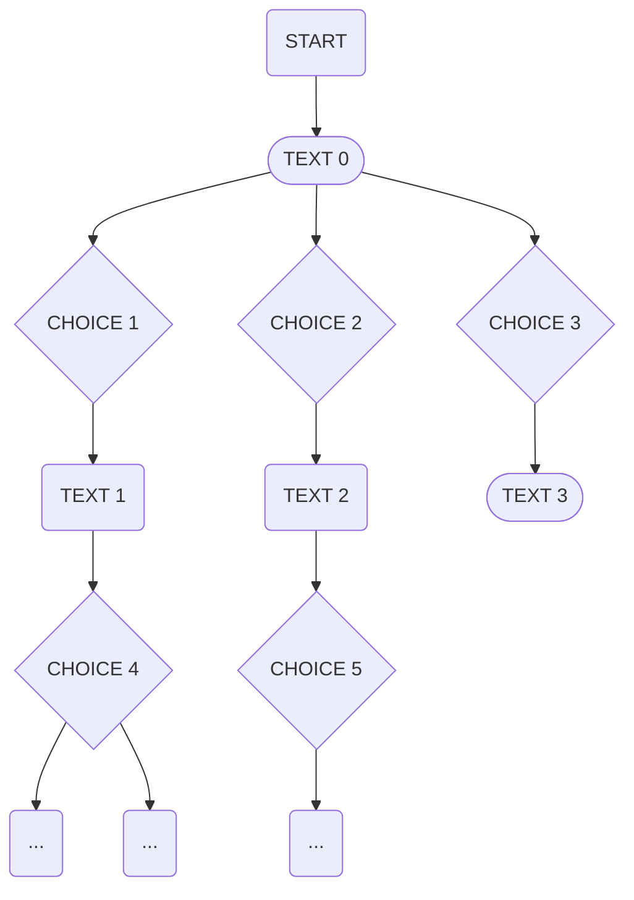
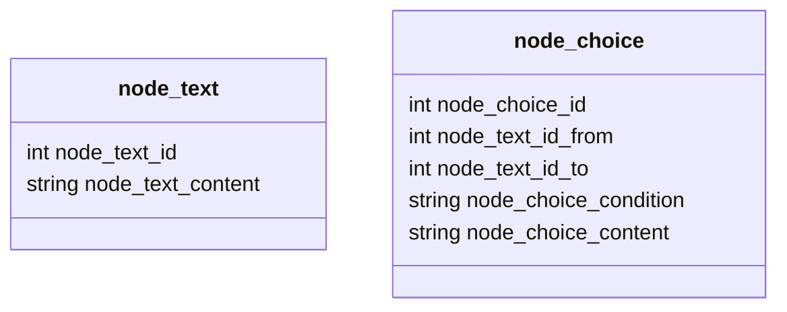

# Architecture - Node - v1 - Mains nodes - Simple version

## Status
`draft`

## Context

### Playbook game
We need to "play" game books, which are text-based games where the player makes choices that affect the outcome of the story. 
The game is played through a web application interface and requires a backend to handle the game logic, state management, and user interactions.
Seems the better way to handle this sort of game is to use a graph structure to represent the game book, where each node is a page or a choice, 
and edges represent the choices leading to other pages.

## Decision

### v1 - Mains nodes - Simple version

For normal playbook game, the relationship between nodes will use node_text_id_from and node_action_id_to.

## Consequences
Pros:
- 

Cons:
-
