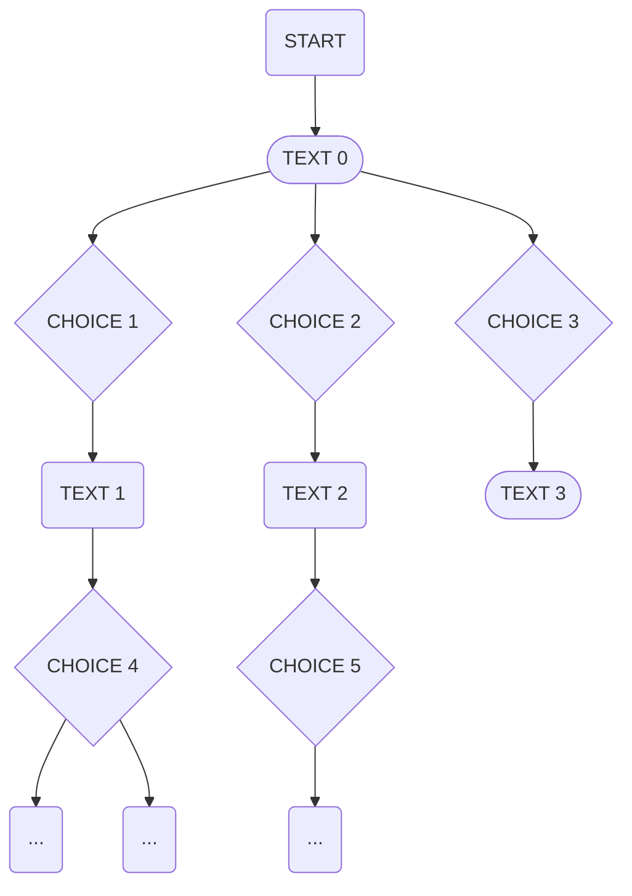
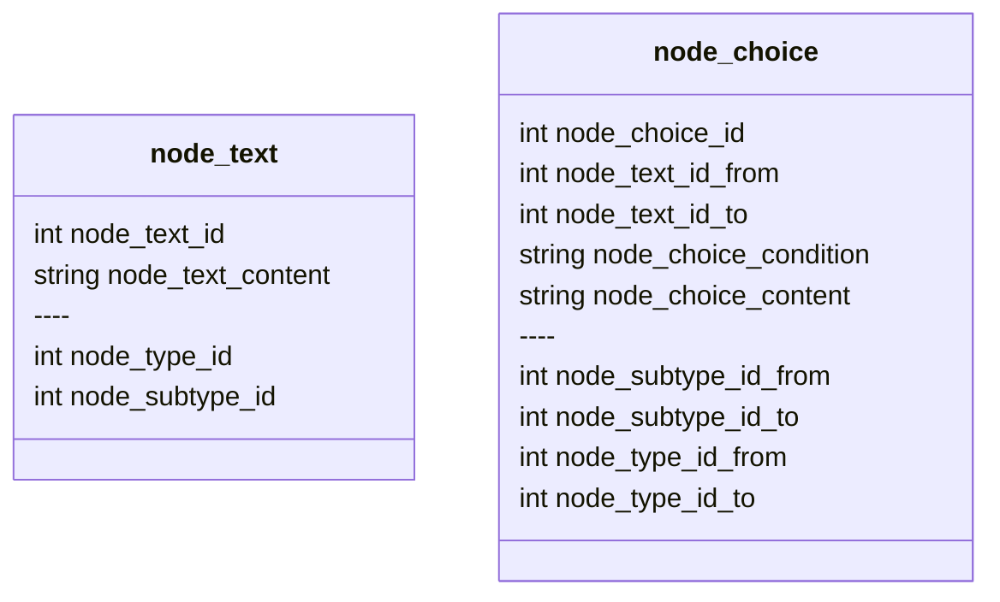
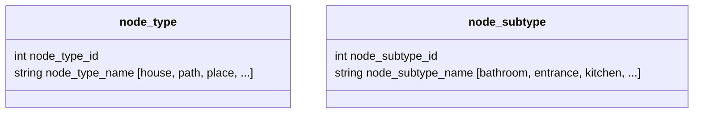

# Architecture - Node - v2 - Mains nodes - With node_type & node_subtype - Rogue-like mode allowed

## Status
`draft`

## Context

### Playbook game
We need to "play" game books, which are text-based games where the player makes choices that affect the outcome of the story. 
The game is played through a web application interface and requires a backend to handle the game logic, state management, and user interactions.
Seems the better way to handle this sort of game is to use a graph structure to represent the game book, where each node is a page or a choice, 
and edges represent the choices leading to other pages.

## Decision

node_type_id(from|to) and node_subtype_id(from|to) will be used to connect nodes randomly by using those constraints.

## Consequences
Pros:
- 

Cons:
-
